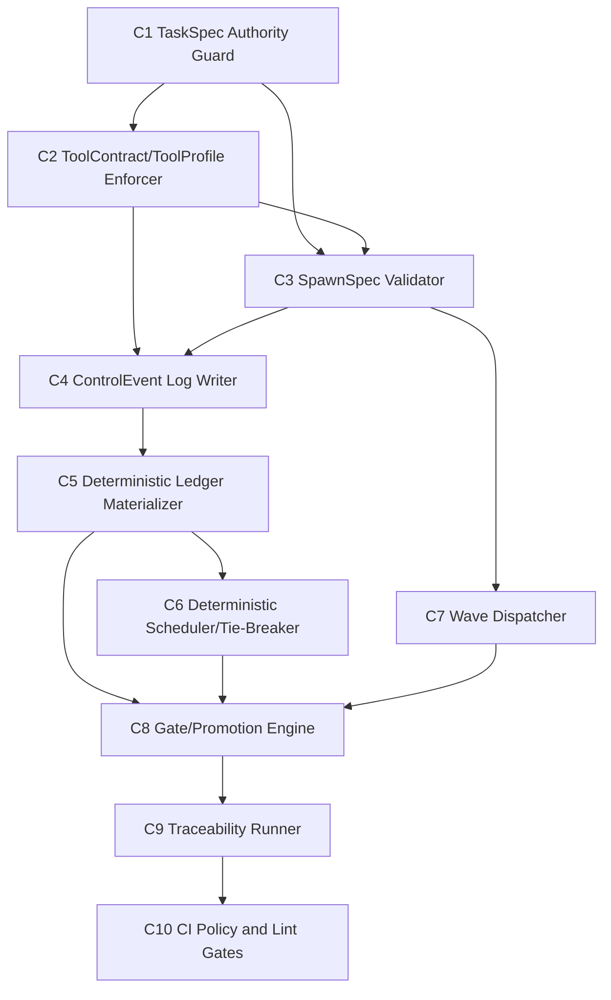

# Ordering DAG (Implementation)

## Node Legend
- `C1` TaskSpec Authority Guard
- `C2` ToolContract/ToolProfile Enforcer
- `C3` SpawnSpec Validator
- `C4` ControlEvent Log Writer
- `C5` Deterministic Ledger Materializer
- `C6` Deterministic Scheduler/Tie-Breaker
- `C7` Wave Dispatcher
- `C8` Gate/Promotion Engine
- `C9` Traceability Runner
- `C10` CI Policy & Lint Gates

## DAG (Mermaid)

## Topological Order (One Valid Sequence)
1. C1
2. C2
3. C3
4. C4
5. C5
6. C6
7. C7
8. C8
9. C9
10. C10

## Alternate Parallel Order
1. C1
2. C2 and C3 (parallel after C1/C2 constraints are clear)
3. C4
4. C5
5. C6 and C7 (parallel)
6. C8
7. C9
8. C10
